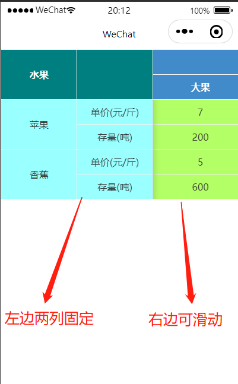

# wechat-table用于在小程序内展示复杂表格

## 功能

    - 支持表头和表格body分组（自定义配置）
    - 支持表格左右滑动（可自定义配置表格固定列）
    - 不支持点击事件

## 与上一版本(v1.0.6)差异

1. 取消headOption.bgColor属性，新增headOption.thStickyStyle和headOption.thStyle属性，用于设置表头单元格样式
2. 新增bodyOption.tdStickyStyle和bodyOption.tdStyle属性，用于设置表格body单元格的样式

## 使用教程

* 下载包之后，使用微信开发者工具构建npm

* 在page.json中引入j-table自定义组件

```js
    {
        "usingComponents": {
            "j-table": "wechat-table/j-table/index"
        }
    }
```

* 在page.wxml模板中使用j-table组件（传入option配置和表格数据data）

```html
<j-table option="{{tableOption}}" data="{{tableData}}" />
```

### option配置

| 参数 | 类型 | 描述 | 默认值 |
|-----|-----|-----|-------|
| headOption | object  | 表头配置   | -     |
| headOption.row | [ [{ }] ]  | 表头行配置：二维数组，每个元素为每一行的配置，每一行包含该行所有单元格的配置对象，单元格配置对象参见下方head接口   | -     |
| headOption.thStickyStyle | string  | 表头固定单元格的样式   | -     |
| headOption.thStyle | string  | 表头可滑动单元格的样式   | -     |
| bodyOption | object  | 表格body配置   | -     |
| bodyOption.row | [ [{ }] ]  | 表格body行配置：二维数组，每个元素为每一行的配置，每一行包含该行所有单元格的配置对象，单元格配置对象参见下方body接口   | -     |
| bodyOption.tdStickyStyle | string  | 表格body固定单元格的样式   | -     |
| bodyOption.tdStyle | string  | 表格body可滑动单元格的样式   | -     |
| colOption | number[]  | 表格每列宽度设置(单位：px，这里填写ipnhoe6下合适的宽度值即可，该组件对其他不同类型设备已做了自适应)。 例：[80, 80, 100, 100]。注意：固定单元格的left属性须与这里配置的对应   | -     |
| width | number  | 表格宽度(单位：px，这里填写ipnhoe6下合适的宽度值即可，该组件对其他不同类型设备已做了自适应)。 | 设备宽度     |

### interface head

| 参数 | 类型 | 描述 | 默认值 |
|-----|-----|-----|-------|
| value | string  | 表头名   | ''     |
| rowspan | number  | 单元格占行数  |   1  |
| colspan| number  | 单元格占列数   | 1  |
| sticky| boolean  | 单元格是否固定  | false  |
| left| number  |  左侧距离(单位：px)，若为固定单元格，则需配置该值  | 0  |

### interface body

| 参数 | 类型 | 描述 | 默认值 |
|-----|-----|-----|-------|
| value | string  | 静态值展示，若设置了value，则直接展示value   | ''     |
| prop| string  | 动态值展示，若未设置value，则展示data[prop]的值(data为表格数据)   | ''     |
| rowspan | number  | 单元格占行数  |   1  |
| colspan| number  | 单元格占列数   | 1  |
| sticky| boolean  | 单元格是否固定  | false  |
| left| number  |  左侧距离(单位：px)，若为固定单元格，则需配置该值  | 0  |
| isLastSticky| boolean  | 是否为该行最后一个固定单元格，该值若为true，会在单元格后显示边框阴影，增强视觉体验  | false  |

### option配置示例

```js
option: {
    headOption: {
        row: [
            [{
                value: '水果',
                rowspan: 2,
                sticky: true,
                left: 0
            }, {
                value: '',
                rowspan: 2,
                sticky: true,
                left: 120
            }, {
                value: '分类',
                colspan: 2
            }],
            [{
                value: '大果',
            }, {
                value: '小果',
            }]
        ],
        thStickyStyle: 'background-color:#007f80;',
        thStyle: 'background-color:#428bca;'
    },
    bodyOption: {
        row: [
            [{
                value: '',
                prop: 'fruitName',
                rowspan: 2,
                sticky: true,
                left: 0
            }, {
                value: '单价(元/斤)',
                sticky: true,
                isLastSticky: true,
                left: 120
            }, {
                prop: 'bigFruitPrice'
            }, {
                prop: 'smallFruitPrice'
            }],
            [{
                value: '存量(吨)',
                sticky: true,
                isLastSticky: true,
                left: 120
            }, {
                prop: 'bigFruitStock'
            }, {
                prop: 'smallFruitStock'
            }]
        ],
        tdStickyStyle: 'background-color:#99ffff;',
        tdStyle: 'background-color:#b3ff66;'
    },
    colOption: [120, 120, 150, 150]
}
```

### 表格数据data示例

```js
[{
        fruitName: '苹果',
        bigFruitPrice: 7,
        smallFruitPrice: 4,
        bigFruitStock: 200,
        smallFruitStock: 300
    },
    {
        fruitName: '香蕉',
        bigFruitPrice: 5,
        smallFruitPrice: 3.5,
        bigFruitStock: 600,
        smallFruitStock: 1000
    }
]
```

#### 若使用上述配置，将呈现出如下页面(若图片加载不出来可以百度一下解决方案)



#### 动画展示  

<iframe height=600 width=400 src="./images/wechat-table.gif">
